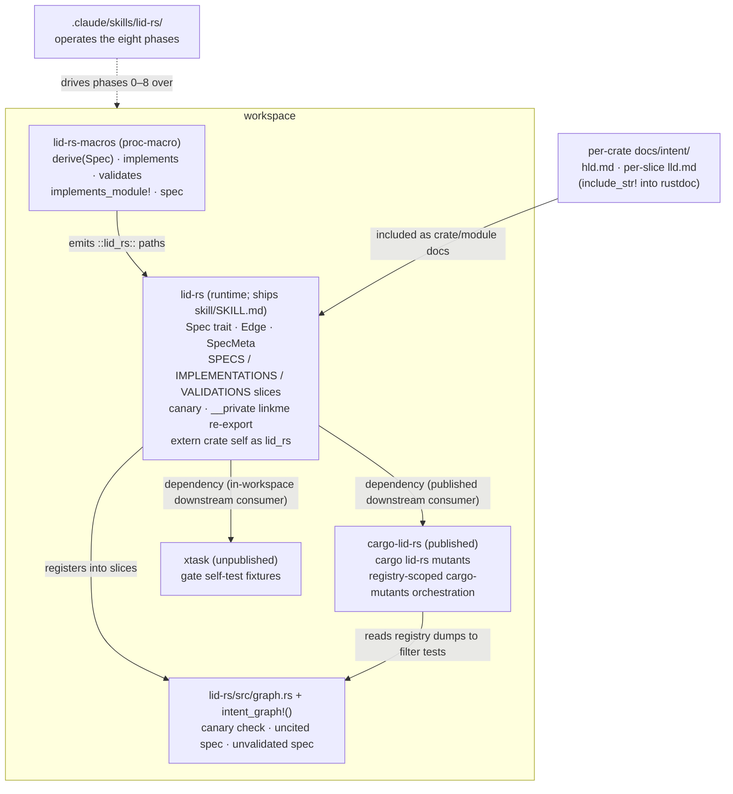

# High-Level Design: LID-rs

## Problem

LID links design intent to code through greppable requirement IDs, but the
linkage is lexical: an `@spec` comment is a string that can cite a deleted
requirement, describe behaviour a function no longer has, or be missing from
code an agent invented. Specs and code drift apart despite the IDs, and the
drift is invisible until a human notices at review time — where humans
are weakest.

`README.md` (the LID-rs specification) designs the fix: make the
spec layer out of Rust items so the compiler resolves every edge of the intent
graph, and gate every structural property so reviewer attention lands on
semantics alone. This workspace builds the toolchain the specification
requires: the `lid-rs` and `lid-rs-macros` crates, the published `cargo-lid-rs`
subcommand, the gate self-test `xtask`, and the operating skill — the standing instruction document an AI
coding agent loads to run the methodology's flow.

## Approach

Build the toolchain as a Cargo workspace that applies LID-rs to itself from the
first commit. Self-hosting is not a stunt: it is the end-to-end proof. The
system is judged working when its own twelve checks run green over its own
intent graph, and when each gate demonstrably fails on a deliberate violation.

Three mechanisms carry it:

- **Compiler-resolved citations.** `#[implements]` / `#[validates]` expand to a
  const type-assertion, so a bad citation is a type error (README [§3.3](https://bradvoth.github.io/lid-rs/spec/mapping.html)).
- **Link-time enumeration.** `linkme` distributed slices collect every spec,
  citation, and validation into the test binary with no source parsing
  (README [§5](https://bradvoth.github.io/lid-rs/spec/registry.html)), guarded by a canary against silently-empty registries.
- **Gated structure.** Twelve checks (README [§4](https://bradvoth.github.io/lid-rs/spec/gates.html)), every one failing the build
  when its property breaks; anything that can't gate gets deleted.

### Bootstrap staging

The macros cannot exist before the runtime crate they emit paths into, and the
runtime crate's own claims cannot be macro-traced before the macros exist. The
staging that resolves this:

1. `lid-rs` core ships first: `Spec` trait, `Edge`, `SpecMeta`, the three
   distributed slices, `__private` linkme re-export — plus **one hand-written
   spec/implementation/validation triple registered with hand-expanded statics,
   which is the permanent canary** (README [§5.3](https://bradvoth.github.io/lid-rs/spec/registry.html)). Hand-expanding first is
   deliberate macro discipline — write the expansion before the macro: it validates the
   expansion design while changing it is free.
2. `lid-rs-macros` ships second and must reproduce the hand-expanded registrations
   exactly; the canary then converts to macro-generated form, proving
   equivalence. `lid-rs` puts `extern crate self as lid_rs;` in its root so the
   emitted `::lid_rs::...` paths resolve inside `lid-rs` itself.
3. Tracing then spreads through `lid-rs`'s own code, the intent-graph checks land,
   `xtask` lands, and the skill lands — each as its own slice, each gated by
   everything already built.

## Target Users

- **A developer–agent pair operating the methodology** on a Rust codebase that
  must stay trustworthy under modification: the developer authors LLDs and
  reviews decompositions; the agent proposes claims, skeletons, tests, and leaf
  implementations inside the constraints the toolchain enforces.
- **This workspace itself** is the first such pair's project, and remains the
  reference deployment.

## Goals

Falsifiable, in delivery order:

1. `cargo test --lib` on this workspace runs the registry checks (uncited spec,
   unvalidated spec) over a canary-verified non-empty registry.
2. `lid-rs-macros` reproduces the hand-expanded canary registrations exactly
   (asserted by test).
3. Every check has a demonstrated failure: for each of the twelve, a test
   (`trybuild` UI test, lint-fixture, or stripped-registry simulation) proves
   the gate catches its violation — not merely that green code passes.
4. `cargo lid-rs mutants` (diff-scoped) narrows each mutant's test set through
   the registry, and a vacuous test (executes but doesn't assert) is caught by it.
5. The skill at `.claude/skills/lid-rs/` walks an agent through the eight
   phases such that a slice of this workspace itself was produced under it.

## Non-Goals

- **No demo/example crate.** Self-hosting plus two downstream consumers —
  `cargo-lid-rs` published, `xtask` in-workspace — is the E2E proof; a showcase app is surface area without new evidence.
- **No nightly, no rustc internals, no source parsing** (README [§2](https://bradvoth.github.io/lid-rs/spec/constraints.html) constraints,
  inherited wholesale).
- **No dependency-rename support.** Consumers must depend on the crate as
  `lid-rs`; `extern crate self as lid_rs` + literal `::lid_rs` paths make dependency
  renames unsupported,
  documented rather than engineered around.
- **No plugin packaging yet.** The skill lives in-repo until proven; promotion
  to a distributable plugin is a later slice.
- **No support for prototypes.** README [§1.2](https://bradvoth.github.io/lid-rs/spec/purpose.html): the correct amount of LID-rs in
  disposable code is zero. Nothing here optimizes for low-ceremony adoption.

## Tenets

Ordered; when two conflict, the higher wins.

1. **The spec follows reality it failed to predict.** The README is a living
   design, not frozen requirements. When building reveals a flaw, revise the
   README and cascade; never silently diverge, never log-and-defer. Git
   history is the revision record — the document itself carries no version
   narration.
2. **A gate that exists, gates.** Every check runs and fails the build from the
   moment it can exist. The repo is never in a state its own methodology would
   reject — including mid-bootstrap.
3. **Constrained-first dependencies.** `syn`, `quote`, `linkme` are the core;
   any further dependency requires evidence that the constrained option failed,
   not an ergonomics preference.

## System Design

`lid-rs` self-hosts: its own claims live in `lid-rs/src/spec/`, its own code carries
`#[implements]`, its own unit tests carry `#[validates]`, and its
`intent_graph!()` instance checks the resulting graph. `cargo-lid-rs` and `xtask` depend on `lid-rs` as
ordinary downstream consumers, which is where macro path-resolution and
linker-section behaviour get exercised outside the self-referential crate;
this workspace runs `cargo-lid-rs` from source (`cargo run -p cargo-lid-rs`),
so the gate always exercises the working tree's tool.

### Slice map (delivery order)

| # | Slice (user-visible operation) | Delivers |
|---|---|---|
| 1 | "A claim, an implementation, and a validation are enumerable at link time" | Workspace scaffolding + Tier 0 lint config (tenet 2), `lid-rs` core, hand-expanded canary triple |
| 2 | "A citation is written as an attribute and resolved by the compiler" | `lid-rs-macros`; canary converts to macro form; expansion-equivalence test |
| 3 | "An uncited or unvalidated spec fails the build" | `graph.rs` checks and the `intent_graph!()` emitter; tracing spread through `lid-rs` itself; gate-failure fixtures |
| 4 | "A vacuous test fails the build" | `xtask` mutation scoping via registry; `[profile.test] opt-level = 0` |
| 5 | "An agent operates the methodology" | `.claude/skills/lid-rs/` skill, validated by producing a slice under it |
| 6 | "The methodology is readable without cloning the repo" | mdBook assembled by inclusion, deployed to GitHub Pages; `docs/intent/book/lld.md` |
| 7 | "The crates build from their published tarballs" | Rename to the `lid-rs` prefix set; intent docs relocated under their crates; publish metadata; `cargo package` in the gate; `docs/intent/publish/lld.md` |
| 8 | "A downstream project runs check 12" | `cargo-lid-rs`: check 12 extracted from `xtask` into a published cargo subcommand with metadata-located root and single-package scope fallback; `xtask` keeps the gate self-test; `cargo-lid-rs/docs/intent/cargo-lid-rs/lld.md` |
| 9 | "A developer creates a LID-ready project" | `cargo lid-rs init` (augments the package in the current directory: dependency, lint tables, thresholds, HLD, spec module, graph checks, CI gate, agent files, skill) and `cargo lid-rs new <name>`; end-to-end validated by the scaffolded package passing its own gate; `cargo-lid-rs/docs/intent/init/lld.md` |
| 10 | "A project updates its skill when it updates `lid-rs`" | The skill ships in the `lid-rs` crate (`skill/SKILL.md`); `cargo lid-rs sync` writes a project's copy from its resolved dependency and `sync --check` gates it, strictly; the skill's 0.2 content from the first external deployment's review; `cargo-lid-rs/docs/intent/sync/lld.md` |

Each slice runs Phases 0–7 (README [§8](https://bradvoth.github.io/lid-rs/spec/flow.html); Phase 8 is the post-slice change loop) with stops at every phase boundary.

## Key Design Decisions

| Decision | Alternatives considered | Rationale |
|---|---|---|
| Self-hosting is the E2E proof; no demo crate | Workspace demo crate implementing README's worked examples | The demo adds no gate the self-host lacks; `cargo-lid-rs` and `xtask` already exercise the downstream-consumer path where linkme/path bugs live. Revisit if a consumer-facing bug class appears that self-hosting can't reproduce. |
| `extern crate self as lid_rs` + literal `::lid_rs` expansion paths | `proc-macro-crate` name lookup at expansion time | Zero dependencies and stable vs. compile-time TOML parsing with workspace-layout fragility (tenet 3). Consumers cannot rename the dependency; the crate's own rename from `lid` was a one-time cascade in which the literal paths named every site. |
| Hand-expand the canary triple before writing macros | Leave `lid-rs` untraced until macros exist, then brownfield-retrofit | Validates the expansion design when changing it is free; gives slice 2 an exact, testable target; the hand-expansion becomes the canary rather than throwaway work. |
| Claims are Rust items in `src/spec/`, descriptive names | Prose EARS files with numbered IDs (classic LID, as the installed `linked-intent-dev` skill defaults to) | README [§3.1](https://bradvoth.github.io/lid-rs/spec/mapping.html)–3.2: compiler-resolved citations require items; names make citation sites self-documenting; rename-breaks-citations is the desired re-review behaviour. `#[spec("...")]` aliases cover genuine foreign keys. |
| `linkme` sections, `inventory` behind a feature flag as fallback | `inventory` primary; build-script codegen; source scanning | Zero runtime cost and no life-before-main on mainstream targets; the escape hatch is a feature flag, not a rewrite (README [§5.4](https://bradvoth.github.io/lid-rs/spec/registry.html)). Source scanning violates constraint 2. |
| Skill developed in-repo, promoted to plugin later | Plugin-shaped from the start | Dogfood the skill where it's built; packaging before the methodology settles would version-churn the plugin. |
| Gates on from the first commit | Switch gates on when all twelve exist | Tenet 2; the bootstrap window is when untraced drift would accrete. |

## Success Metrics

- The [§4.5](https://bradvoth.github.io/lid-rs/spec/gates.html) gate passes on this workspace at every slice boundary, and CI runs
  it on every push.
- Each of the twelve checks has a committed failure demonstration (Goal 3). A
  check with no demonstrated failure is presumed vacuous and either gets one or
  gets deleted (README constraint 3).
- The canary equivalence test (Goal 2) stays green across `lid-rs-macros` changes.
- Falsification signals: a registry check passing over an empty registry; a
  gate that must be skipped to land a slice; macro output drifting from what
  the canary hand-expansion asserts; the README contradicting shipped behaviour
  for longer than the slice that discovered it.

## References

- `README.md` — the LID-rs specification; the design this
  workspace implements and, per tenet 1, revises.
- [`linkme`](https://github.com/dtolnay/linkme) — distributed-slice mechanism.
- [`cargo-mutants`](https://mutants.rs) — mutation engine under check 12.
- The installed `linked-intent-dev` skill — supplies the phase-stop and cascade
  process discipline; its classic-LID artifact formats are superseded here (see
  `CLAUDE.md`).
