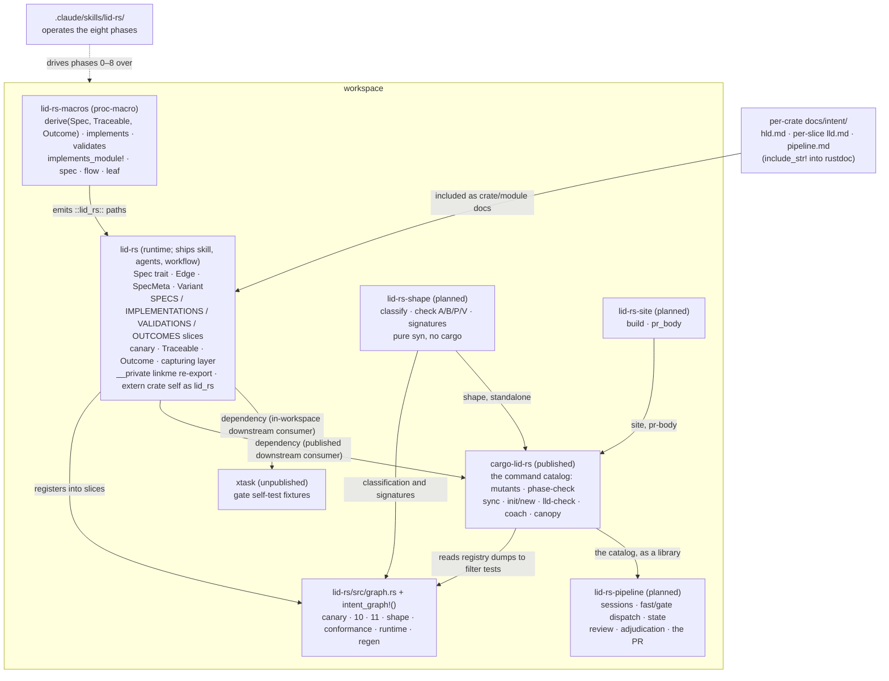

# High-Level Design: LID-rs

## Problem

LID links design intent to code through greppable requirement IDs, but the
linkage is lexical: an `@spec` comment is a string that can cite a deleted
requirement, describe behaviour a function no longer has, or be missing from
code an agent invented. Specs and code drift apart despite the IDs, and the
drift is invisible until a human notices at review time — where humans
are weakest.

`README.md` (the LID-rs specification) designs the fix: make the
spec layer out of Rust items so the compiler resolves every edge of the intent
graph, and gate every structural property so reviewer attention lands on
semantics alone. This workspace builds the toolchain the specification
requires: the `lid-rs` and `lid-rs-macros` crates, the published `cargo-lid-rs`
subcommand, the gate self-test `xtask`, and the operating skill — the standing instruction document an AI
coding agent loads to run the methodology's flow — and, as the specification
grew past what the compiler alone can check, the `lid-rs-shape` and
`lid-rs-site` libraries the later checks need and the `lid-rs-pipeline`
harness that runs the phases unattended. The pipeline has its own living
specification, `lid-rs-pipeline/docs/intent/pipeline.md`: `README.md` says
what is checked; the pipeline document says how a slice is built without a
human at the keyboard.

## Approach

Build the toolchain as a Cargo workspace that applies LID-rs to itself from the
first commit. Self-hosting is not a stunt: it is the end-to-end proof. The
system is judged working when every check README [§4](https://bradvoth.github.io/lid-rs/spec/gates.html)
defines and this workspace has built runs green over its own intent graph,
and when each gate demonstrably fails on a deliberate violation.

Three mechanisms carry it:

- **Compiler-resolved citations.** `#[implements]` / `#[validates]` expand to a
  const type-assertion, so a bad citation is a type error (README [§3.3](https://bradvoth.github.io/lid-rs/spec/mapping.html)).
- **Link-time enumeration.** `linkme` distributed slices collect every spec,
  citation, and validation into the test binary with no source parsing
  (README [§5](https://bradvoth.github.io/lid-rs/spec/registry.html)), guarded by a canary against silently-empty registries.
- **Gated structure.** Twenty-six checks (README [§4](https://bradvoth.github.io/lid-rs/spec/gates.html)) — twelve built, the
  rest specified and numbered by seam — every one failing the build
  when its property breaks; anything that can't gate gets deleted.
- **Claims as structure, then as spans.** The controlled language (README [§3.5](https://bradvoth.github.io/lid-rs/spec/mapping.html))
  makes a claim's parts comparable to signatures and enums; the runtime
  (README [§6.4](https://bradvoth.github.io/lid-rs/spec/traced.html)) makes its satisfaction observable in a test's trace and in
  production.

### Bootstrap staging

The macros cannot exist before the runtime crate they emit paths into, and the
runtime crate's own claims cannot be macro-traced before the macros exist. The
staging that resolves this:

1. `lid-rs` core ships first: `Spec` trait, `Edge`, `SpecMeta`, the three
   distributed slices, `__private` linkme re-export — plus **one hand-written
   spec/implementation/validation triple registered with hand-expanded statics,
   which is the permanent canary** (README [§5.3](https://bradvoth.github.io/lid-rs/spec/registry.html)). Hand-expanding first is
   deliberate macro discipline — write the expansion before the macro: it validates the
   expansion design while changing it is free.
2. `lid-rs-macros` ships second and must reproduce the hand-expanded registrations
   exactly; the canary then converts to macro-generated form, proving
   equivalence. `lid-rs` puts `extern crate self as lid_rs;` in its root so the
   emitted `::lid_rs::...` paths resolve inside `lid-rs` itself.
3. Tracing then spreads through `lid-rs`'s own code, the intent-graph checks land,
   `xtask` lands, and the skill lands — each as its own slice, each gated by
   everything already built.

## Target Users

- **A developer–agent pair operating the methodology** on a Rust codebase that
  must stay trustworthy under modification: the developer authors LLDs and
  reviews decompositions; the agent proposes claims, skeletons, tests, and leaf
  implementations inside the constraints the toolchain enforces.
- **This workspace itself** is the first such pair's project, and remains the
  reference deployment.

## Goals

Falsifiable, in delivery order:

1. `cargo test --lib` on this workspace runs the registry checks (uncited spec,
   unvalidated spec) over a canary-verified non-empty registry.
2. `lid-rs-macros` reproduces the hand-expanded canary registrations exactly
   (asserted by test).
3. Every check has a demonstrated failure: for each check that has landed, a test
   (`trybuild` UI test, lint-fixture, or stripped-registry simulation) proves
   the gate catches its violation — not merely that green code passes.
4. `cargo lid-rs mutants` (diff-scoped) narrows each mutant's test set through
   the registry, and a vacuous test (executes but doesn't assert) is caught by it.
5. The skill at `.claude/skills/lid-rs/` walks an agent through the eight
   phases such that a slice of this workspace itself was produced under it.
6. `#[derive(Spec)]` rejects a malformed claim at compile time (check 13) and
   extracts `SpecMeta` from a well-formed one; every claim in this workspace
   is either in the language or carries a counted `#[lid(free)]` mark, and
   the count falls to zero slice by slice.
7. The shape pass classifies every function in this workspace as flow or
   leaf, and rules A, B, P, and V each have a demonstrated failure.
8. A validator's captured trace fails checks 23–25 on a demonstrated wrong
   outcome, and the same spans reach a production subscriber.
9. A slice of this workspace is built from a draft PR to a ready PR with no
   human turn between, and `main` receives it as one squash commit whose
   trailers resolve.

## Non-Goals

- **No demo/example crate.** Self-hosting plus two downstream consumers —
  `cargo-lid-rs` published, `xtask` in-workspace — is the E2E proof; a showcase app is surface area without new evidence.
- **No nightly, no rustc internals, no source parsing** (README [§2](https://bradvoth.github.io/lid-rs/spec/constraints.html) constraints,
  inherited wholesale).
- **No dependency-rename support.** Consumers must depend on the crate as
  `lid-rs`; `extern crate self as lid_rs` + literal `::lid_rs` paths make dependency
  renames unsupported,
  documented rather than engineered around.
- **No plugin packaging yet.** The skill lives in-repo until proven; promotion
  to a distributable plugin is a later slice.
- **No support for prototypes.** README [§1.3](https://bradvoth.github.io/lid-rs/spec/purpose.html): the correct amount of LID-rs in
  disposable code is zero. Nothing here optimizes for low-ceremony adoption.

## Tenets

Ordered; when two conflict, the higher wins.

1. **The spec follows reality it failed to predict.** The README is a living
   design, not frozen requirements. When building reveals a flaw, revise the
   README and cascade; never silently diverge, never log-and-defer. Git
   history is the revision record — the document itself carries no version
   narration.
2. **A gate that exists, gates.** Every check runs and fails the build from the
   moment it can exist. The repo is never in a state its own methodology would
   reject — including mid-bootstrap.
3. **Constrained-first dependencies.** `syn`, `quote`, `linkme` are the core;
   any further dependency requires evidence that the constrained option failed,
   not an ergonomics preference. `tracing` is the one escalation taken so far;
   the evidence is in the decisions table.

## System Design

`lid-rs` self-hosts: its own claims live in `lid-rs/src/spec/`, its own code carries
`#[implements]`, its own unit tests carry `#[validates]`, and its
`intent_graph!()` instance checks the resulting graph. `cargo-lid-rs` and `xtask` depend on `lid-rs` as
ordinary downstream consumers, which is where macro path-resolution and
linker-section behaviour get exercised outside the self-referential crate;
this workspace runs `cargo-lid-rs` from source (`cargo run -p cargo-lid-rs`),
so the gate always exercises the working tree's tool.

### Slice map (delivery order)

| # | Slice (user-visible operation) | Delivers |
|---|---|---|
| 1 | "A claim, an implementation, and a validation are enumerable at link time" | Workspace scaffolding + Tier 0 lint config (tenet 2), `lid-rs` core, hand-expanded canary triple |
| 2 | "A citation is written as an attribute and resolved by the compiler" | `lid-rs-macros`; canary converts to macro form; expansion-equivalence test |
| 3 | "An uncited or unvalidated spec fails the build" | `graph.rs` checks and the `intent_graph!()` emitter; tracing spread through `lid-rs` itself; gate-failure fixtures |
| 4 | "A vacuous test fails the build" | `xtask` mutation scoping via registry; `[profile.test] opt-level = 0` |
| 5 | "An agent operates the methodology" | `.claude/skills/lid-rs/` skill, validated by producing a slice under it |
| 6 | "The methodology is readable without cloning the repo" | mdBook assembled by inclusion, deployed to GitHub Pages; `docs/intent/book/lld.md` |
| 7 | "The crates build from their published tarballs" | Rename to the `lid-rs` prefix set; intent docs relocated under their crates; publish metadata; `cargo package` in the gate; `docs/intent/publish/lld.md` |
| 8 | "A downstream project runs check 12" | `cargo-lid-rs`: check 12 extracted from `xtask` into a published cargo subcommand with metadata-located root and single-package scope fallback; `xtask` keeps the gate self-test; `cargo-lid-rs/docs/intent/cargo-lid-rs/lld.md` |
| 9 | "A developer creates a LID-ready project" | `cargo lid-rs init` (augments the package in the current directory: dependency, lint tables, thresholds, HLD, spec module, graph checks, CI gate, agent files, skill) and `cargo lid-rs new <name>`; end-to-end validated by the scaffolded package passing its own gate; `cargo-lid-rs/docs/intent/init/lld.md` |
| 10 | "A project updates its skill when it updates `lid-rs`" | The skill ships in the `lid-rs` crate (`skill/SKILL.md`); `cargo lid-rs sync` writes a project's copy from its resolved dependency and `sync --check` gates it, strictly; the skill's 0.2 content from the first external deployment's review; `cargo-lid-rs/docs/intent/sync/lld.md` |
| 11 | "A phase is run by an agent that can only edit, and its commit is the check passing" | The per-phase agents and their hooks (path policy, per-edit clippy, stop = check + commit), `cargo lid-rs phase-check N`, the `lid-rs` workflow, the tally trailers; `cargo-lid-rs/docs/intent/phase/lld.md` |
| 12 | "A slice is built headless, one session per phase" | `cargo lid-rs canopy`: the harness proof — a session per phase worker and per review, deterministic code between, proven live to the completion the key was not permitted to land; `cargo-lid-rs/docs/intent/headless-canopy-agent/lld.md` |
| 13 | "An LLD is reviewed before its phases run" | `cargo lid-rs lld-check`, the guideline `skill/references/lld.md`, the advisory `lid-rs-lld-review` agent; `cargo-lid-rs/docs/intent/lld-review/lld.md` |
| 14 | "A human drafts an LLD with a coach" | `cargo lid-rs coach`: the interview that opens with the repository's intent index; `cargo-lid-rs/docs/intent/coach/lld.md` |
| 15 | "A claim is written in the controlled language" | `derive(Spec)` enforces README [§3.5](https://bradvoth.github.io/lid-rs/spec/mapping.html) and extracts `SpecMeta`; the base lexicon and `docs/intent/lexicon.toml` with templates; checks 13 and 14; every existing claim marked `#[lid(free)]`, counted and enumerable, burned down per slice; preceded by a `phase` change admitting a proc-macro crate's slice into its companion crate; `lid-rs-macros/src/claim/lld.md` |
| 16 | "A slice's artifacts live in one directory" | The colocated layout (README [§11.1](https://bradvoth.github.io/lid-rs/spec/layout.html)): `lld.md`, `spec.rs`, `mod.rs` under `src/<slice>/`; the phase policy, `init`/`new`, `lld-check`, the coach's index, the book, and every citation path moved in one mechanical cascade; the uncitable-claim assertion, whose path the layout defines |
| 22 | "A check is a command with a finding" | **Delivered.** The `cargo lid-rs` catalog (pipeline §5): the command table over `Invocation`, the finding schema, `Status`, the two provenances, and five built commands — `check`, `lint`, `doc`, `package`, `sync`. **Not delivered, and deferred by that slice to `lld/phase--gate-from-metadata`:** the composites in workspace metadata, `fast`, and the `phase-check N` → `gate --phase N` rename. `--expect` and `validate --claims`/`--red` wait on slices 19 and 20 |
| 17 | "A slice's nouns are types the LLD links to" | `derive(Traceable)` with its policy attributes; `vocab` modules; LLDs rewritten with vocabulary links (check 2 enforces them) |
| 18 | "A function is flow or leaf by its shape" | `lid-rs-shape`: F1–F6, rules A/B/P/V, checks 15–18, `#[flow]`/`#[leaf]`, `cargo lid-rs shape`, `shape.level`; the complexity threshold re-measured with the classification in hand |
| 19 | "A signature keeps the promise its claim makes" | `derive(Outcome)`, `OUTCOMES`, `signatures()`, checks 19–22, `conformance.level` and `aliases` |
| 20 | "A claim's satisfaction is observable at runtime" | `tracing` spans in `#[implements]`, the capturing layer in `#[validates]`, `Traceable` recording, checks 23–25, `lid_rs::spawn`, `runtime.level`; the test output that reads as the claims exercised |
| 21 | "The intent graph is readable as a page" | `regen` and `docs/intent/trace.md` with check 26; `lid-rs-site`: claim cards, the observed flow graph, the trace matrix, the glossary |
| 23 | "A slice builds itself from a draft PR" | `lid-rs-pipeline`: sessions from the canopy client, `fast`/`gate` dispatch, state and resumption, the phase reviewers' rubrics, adjudication and the registered question, publication, `CODEOWNERS` and the rulesets, the squash message |

Slices 1–15 are delivered. Slices 16–23 are the convergence of this
workspace with the design it was forked from and then outgrew — the README's
unbuilt ledger (README [§12](https://bradvoth.github.io/lid-rs/spec/limits.html))
names the same work from the specification's side. **The rows are in delivery
order and the numbers are stable**, which is why 22 now sits third: a slice's
number is its name, and the seam rule that kept checks 10–12 in place keeps
these too — renumbering to close the gap would rename six slices to move one.

In dependency order: the layout (16) moves every claim's path before the
burn-down of 15's marks rewrites any claim's text; the catalog (22) wraps
checks that already exist and so is blocked by nothing, which is what lets it
move; conformance (19) needs the claim's parts (15) and signatures (18); the
runtime (20) needs 15 and 17 **built**, not merely designed — a span's
parameter recording is a compile-time bound against `Traceable`, and a macro
cannot bound on a trait with no definition — and it may be pulled ahead of 18
but **not** of 19, since `lid.outcome` is recorded through the return type's
`Outcome` impl, with check 25 then landing beside 18; the page (21) needs
everything it renders, and check 26 compares `trace.md` against the registry
*and* the shape pass, so a registry-only document would ship a check gating
half of what it names; the pipeline (23) runs the catalog, and only its
`fast`/`gate` dispatch waits on the composites slice 22 deferred.

Each slice runs Phases 0–7 (README [§8](https://bradvoth.github.io/lid-rs/spec/flow.html); Phase 8 is the post-slice change loop) with stops at every phase boundary.

## Key Design Decisions

| Decision | Alternatives considered | Rationale |
|---|---|---|
| Self-hosting is the E2E proof; no demo crate | Workspace demo crate implementing README's worked examples | The demo adds no gate the self-host lacks; `cargo-lid-rs` and `xtask` already exercise the downstream-consumer path where linkme/path bugs live. Revisit if a consumer-facing bug class appears that self-hosting can't reproduce. |
| `extern crate self as lid_rs` + literal `::lid_rs` expansion paths | `proc-macro-crate` name lookup at expansion time | Zero dependencies and stable vs. compile-time TOML parsing with workspace-layout fragility (tenet 3). Consumers cannot rename the dependency; the crate's own rename from `lid` was a one-time cascade in which the literal paths named every site. |
| Hand-expand the canary triple before writing macros | Leave `lid-rs` untraced until macros exist, then brownfield-retrofit | Validates the expansion design when changing it is free; gives slice 2 an exact, testable target; the hand-expansion becomes the canary rather than throwaway work. |
| Claims are Rust items in `src/spec/`, descriptive names | Prose EARS files with numbered IDs (classic LID, as the installed `linked-intent-dev` skill defaults to) | README [§3.1](https://bradvoth.github.io/lid-rs/spec/mapping.html)–3.2: compiler-resolved citations require items; names make citation sites self-documenting; rename-breaks-citations is the desired re-review behaviour. `#[spec("...")]` aliases cover genuine foreign keys. |
| `linkme` sections, `inventory` behind a feature flag as fallback | `inventory` primary; build-script codegen; source scanning | Zero runtime cost and no life-before-main on mainstream targets; the escape hatch is a feature flag, not a rewrite (README [§5.4](https://bradvoth.github.io/lid-rs/spec/registry.html)). Source scanning violates constraint 2. |
| Skill developed in-repo, promoted to plugin later | Plugin-shaped from the start | Dogfood the skill where it's built; packaging before the methodology settles would version-churn the plugin. |
| Gates on from the first commit | Switch gates on when every check exists | Tenet 2; the bootstrap window is when untraced drift would accrete. |
| `tracing` for claim spans (slice 20) | A `lid-rs`-owned thread-local recorder; spans behind a feature flag | The feature's payoff is production telemetry in the requirements' language (README [§6.7](https://bradvoth.github.io/lid-rs/spec/traced.html)), which needs an ecosystem subscriber, and span propagation across `await` (README [§6.8](https://bradvoth.github.io/lid-rs/spec/traced.html)), which needs a global layer. A recorder proves checks 23–25 and nothing else, so the constrained option fails at design time rather than after being built twice; a feature flag contradicts "nothing is enforced by opt-in" (README [§2](https://bradvoth.github.io/lid-rs/spec/constraints.html)). Tenet 3's escalation, with the evidence stated. |
| The colocated slice layout is its own slice (16), after the language lands strict and before its marks are burned down | With the controlled language, as one cascade; keep `src/spec/` | The language lands by marking every claim `#[lid(free)]`, not by rewriting it, so there is no rename cascade for the layout to ride; the burn-down that follows rewrites claims slice by slice, and each rewrite is cheaper once a slice's claims already sit beside its module. The layout also answers a measured fault: a claim registered but uncitable because `src/spec/mod.rs` did not re-export it. |
| A proc-macro crate's slice keeps its claims, companion module, and fixtures in the crate that re-exports its macros | Build such slices by hand, as the macros slice was; a phase agent with a widened path policy | The derive, `Traceable`, `Outcome`, and the spans are all proc-macro work, and a proc-macro crate links into no binary a claim could register in. A stated rule of the `phase` slice keeps those four slices under the gate; a widened policy is a hole in the thing the policy exists for. |
| The pipeline is its own crate, with its own living specification | Fold the harness into `cargo-lid-rs`; a document with no crate | The harness consumes the catalog as a library, the way the canopy client already does, and its dependencies — HTTP, a door, a PR API — are not the catalog's. Its specification is the crate's front page so check 2 link-checks it from the first commit. |
| The catalog (22) is delivered third, after the layout (16) | Leave it eighth, in the order the convergence first wrote; renumber the slices to close the gap | The claim slice's amendment rate was measured before deciding: of thirteen Phase 1 amendments, three came from vocabulary (17) and two from layout (16), so front-loading the ambiguity slices addresses a minority. The operational failures are the larger cost — every Phase 7 on this project has been killed by the 600 s watchdog and run by hand, and the `cargo package` breakage surfaced only at the Phase 7 gate, long after the change that caused it. The catalog's atomic commands and finding schema are what let a gate run in pieces and fail legibly, and it wraps checks that already exist, so nothing blocks it. Numbers stay put: a number is a name (the seam rule above). |
| New checks numbered by seam (13–26); 10, 11, 12 keep their numbers | Renumber to the forked design's 1–26 order | 52 sites outside README cite sections and checks by number, and the precedent (the structural pass of 2026-08-25) is seams, not renumbering. A number is a name; renaming names is what this methodology makes expensive on purpose. |

## Success Metrics

- The [§4.5](https://bradvoth.github.io/lid-rs/spec/gates.html) gate passes on this workspace at every slice boundary, and CI runs
  it on every push.
- Each built check has a committed failure demonstration (Goal 3). A
  check with no demonstrated failure is presumed vacuous and either gets one or
  gets deleted (README constraint 3).
- The README's unbuilt ledger (README [§12](https://bradvoth.github.io/lid-rs/spec/limits.html))
  shrinks by exactly the slice that lands; a mechanism the README describes
  as built that is not is a falsification.
- The canary equivalence test (Goal 2) stays green across `lid-rs-macros` changes.
- Falsification signals: a registry check passing over an empty registry; a
  gate that must be skipped to land a slice; macro output drifting from what
  the canary hand-expansion asserts; the README contradicting shipped behaviour
  for longer than the slice that discovered it.

## References

- `README.md` — the LID-rs specification; the design this
  workspace implements and, per tenet 1, revises.
- [`linkme`](https://github.com/dtolnay/linkme) — distributed-slice mechanism.
- [`cargo-mutants`](https://mutants.rs) — mutation engine under check 12.
- [`tracing`](https://docs.rs/tracing) — the span mechanism under checks 23–25.
- `lid-rs-pipeline/docs/intent/pipeline.md` — the pipeline's living
  specification; the design slices 22 and 23 implement.
- The installed `linked-intent-dev` skill — supplies the phase-stop and cascade
  process discipline; its classic-LID artifact formats are superseded here (see
  `CLAUDE.md`).
